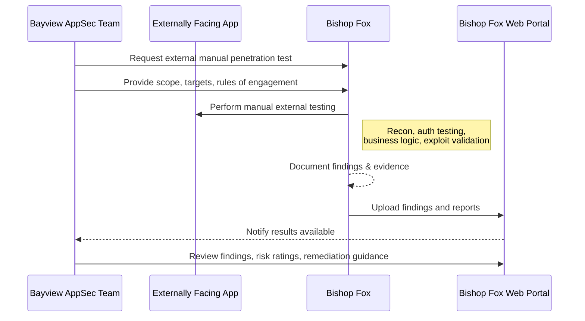

    Generate me a mermaid sequence diagram that shows how Bishop Fox runs external, manual pen tests against our externally facing apps, and gives us results in a web portal. Keep it simple.

```mermaid
sequenceDiagram
    participant Bayview as Bayview AppSec Team
    participant App as Externally Facing App
    participant BF as Bishop Fox
    participant Portal as Bishop Fox Web Portal

    Bayview->>BF: Request external manual penetration test
    Bayview->>BF: Provide scope, targets, rules of engagement

    BF->>App: Perform manual external testing
    Note right of BF: Recon, auth testing,<br/>business logic, exploit validation

    BF-->>BF: Document findings & evidence

    BF->>Portal: Upload findings and reports
    Portal-->>Bayview: Notify results available

    Bayview->>Portal: Review findings, risk ratings, remediation guidance
```