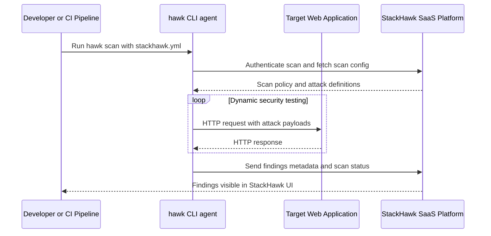
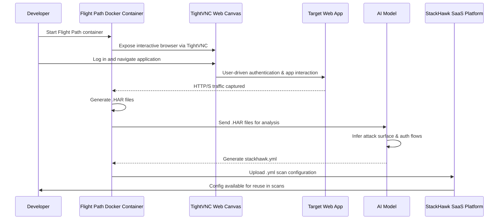

    generate a mermaid diagram that outlines how StackHawk works - the `hawk` cli, the web app being scanned, and how http traffic flows between `hawk` cli (agent), the web app victim, and the StackHawk SaaS platform. Don't use   or special chars for diagram labels.

---------------------------------------------------------------------------------------------------

    generate a mermaid diagram that outlines how StackHawk Flight Path works - their docker container with TightVNC webcanvas for login, that sends .HAR files to an AI model that then generates .yml files that get stored in their SaaS platform for later use.

    2. make it a sequence diagram

---------------------------------------------------------------------------------------------------
