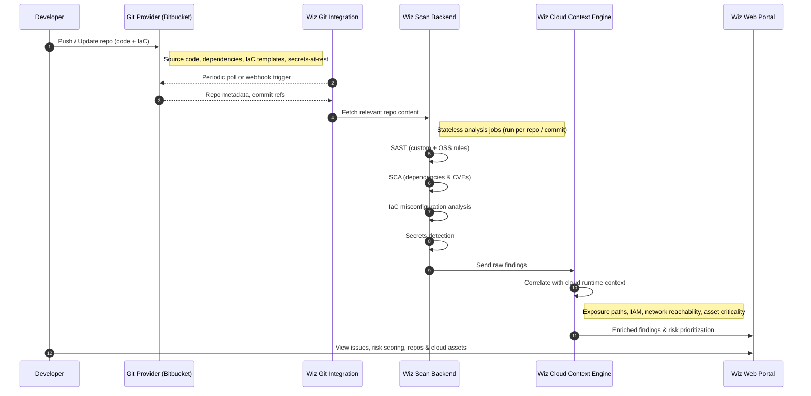
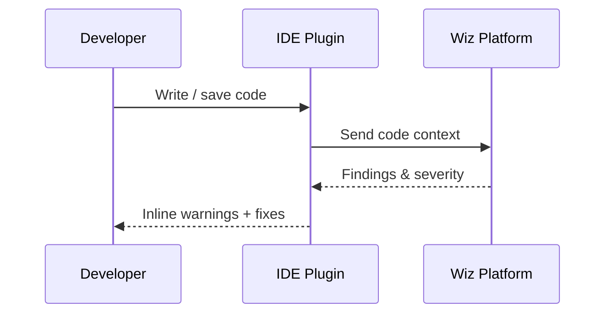
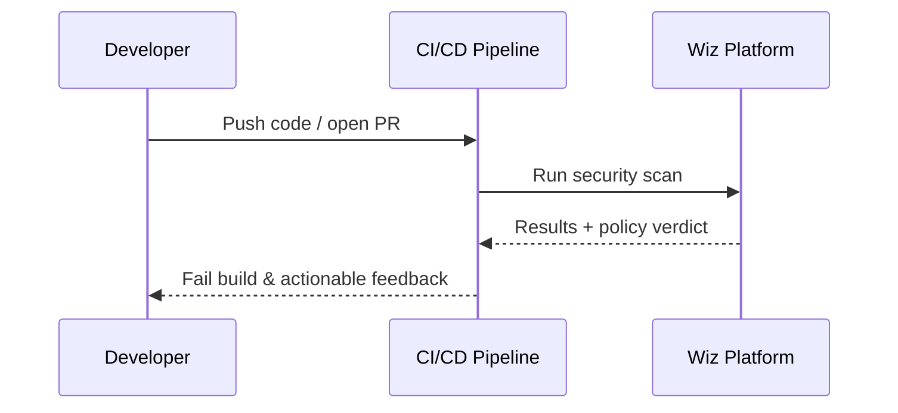

    Generate a mermaid diagram that outlines how Wiz does SAST/IaC/Secrets/SCA scanning - their scan backend periodically connecting to Git providers like BitBucket, and then showing results in their web portal. make it a sequence diagram.

------------------------------------------------------------------------------------------

    Generate two short mermaid sequence diagrams showing how Wiz IDE plugins work, and also how Wiz CICD scans work to break builds and give devs quick feedback.

