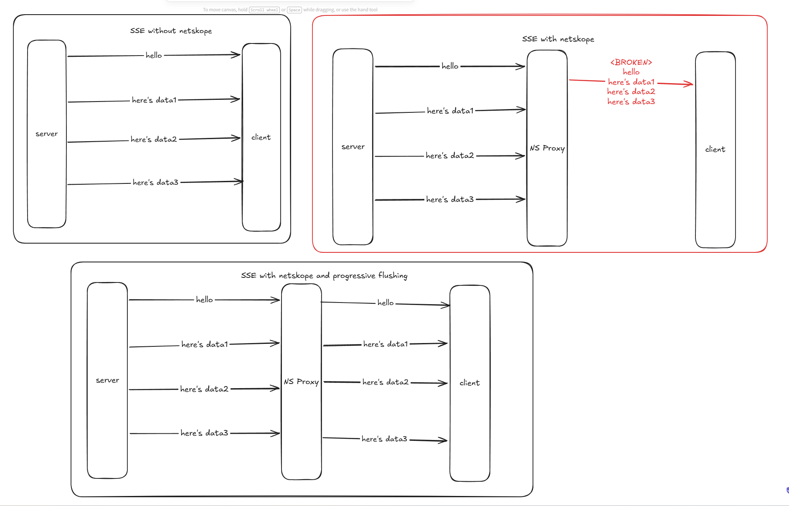

# Why Does Netskope Break SSE Traffic?

## Summary

Netskope breaks Cursor SSE traffic because TLS inspection terminates and re-originates the connection through an inspected proxy path. That proxy path appears to buffer or coalesce `text/event-stream` and chunked responses instead of flushing each event as it arrives. Cursor diagnostics show that TLS, DNS, authentication, and basic API connectivity succeed, but streamed responses stall for roughly five seconds and then arrive all at once. That behavior is incompatible with SSE and with Cursor Agent's bidirectional HTTP/2 streaming.

Because the failure is caused by the inspection path itself, trusting or pinning the Netskope MITM certificate will not resolve it. Until Netskope can preserve progressive flushing and true full-duplex HTTP/2 behavior for Cursor traffic, the practical fix is to bypass SSL decryption and content inspection for the relevant Cursor domains with a "Do Not Decrypt" / SSL Decryption Bypass policy.

## Diagram



## Support Request

Hi Netskope Support,

We need help correcting Netskope proxy behavior for Cursor traffic. We use Netskope as a TLS/SSL inspection proxy, and Cursor Network Diagnostics show that TLS, DNS, API, authentication, and basic connectivity succeed. However, streaming traffic is being buffered or broken by the proxy.

This does not appear to be only a certificate trust issue. The Netskope-issued MITM certificate is visible, and TLS completes with HTTP 200. The functional failure is streaming behavior.

## Evidence

Evidence from three Cursor diagnostic runs is below.

### HTTP/2 Run

HTTP/2 negotiates successfully:

```text
Protocol: h2
Result: true in 373ms
```

SSL inspection is active:

```text
Issuer: C=US; O=Bayview Asset Management; CN=ca.bayview-poc.goskope.com
Status: 200
```

Chat streaming is buffered:

```text
Response: 'foo' in 5307ms
Response: 'foo' in 0ms
Response: 'foo' in 0ms
Response: 'foo' in 0ms
```

Agent traffic fails specifically on the HTTP/2 proxy path:

```text
Error: Bidirectional streaming is not supported by the http2 proxy in your network environment
```

### HTTP/1.1 Run

DNS, SSL, API, Ping, Authentication, Marketplace, and CDN all succeed.

SSL inspection is again active:

```text
Issuer: C=US; O=Bayview Asset Management; CN=ca.bayview-poc.goskope.com
```

Chat still fails with proxy buffering:

```text
Starting streamSSE
Response: 'foo' in 5107ms
Response: 'foo' in 0ms
Response: 'foo' in 0ms
Response: 'foo' in 0ms
```

### HTTP/1.0 Run

Agent succeeds when not using the HTTP/2 path.

Chat still fails:

```text
Error: Streaming responses are being buffered by a proxy in your network environment
```

Same buffering signature:

```text
Response: 'foo' in 5171ms
Response: 'foo' in 1ms
Response: 'foo' in 0ms
Response: 'foo' in 0ms
```

## Requested Change

Please configure Netskope so Cursor streaming traffic is not buffered or transformed. Specifically, we need one of the following:

- Disable response buffering and content inspection for Cursor streaming endpoints.
- Preserve progressive flushing for SSE, `text/event-stream`, and chunked responses.
- Ensure true full-duplex HTTP/2 streaming support for Cursor Agent traffic.
- If inspection cannot support this behavior, apply an SSL Decryption Bypass / "Do Not Decrypt" policy for Cursor domains.

## Relevant Cursor Domains

The following Cursor domains appeared in diagnostics:

```text
api2.cursor.sh
api3.cursor.sh
agent.api5.cursor.sh
repo42.cursor.sh
prod.authentication.cursor.sh
authenticator.cursor.sh
marketplace.cursorapi.com
cursor-cdn.com
downloads.cursor.com
```
